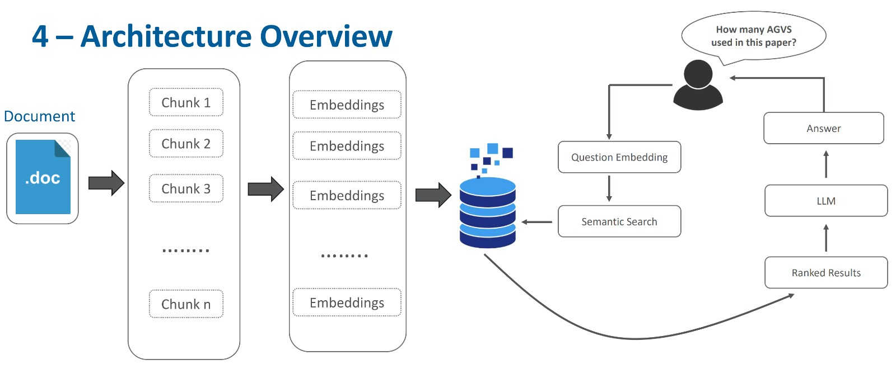

# DocuTalk-AI
An AI-powered document assistant to process files and answer questions interactively.

## Features

- **AI-Powered Search**:Retrieve information quickly using LangChain and OpenAI embeddings  .
- **Custom Embeddings**: Supports Hugging Face models for versatile embeddings.
- **Vector Database**  : Efficiently stores and retrieves document embeddings using Pinecone.
- **Interactive Frontend**: Built with Streamlit for a seamless user experience
- **Scalability**: Designed for efficient handling of large document sets and queries

## Technology Stack

- **Backend**: LangChain, OpenAI API, Hugging Face
- **Vector Database**: Pinecone
- **Frontend**: Streamlit
- **Authentication**: Firebase

- ## How to Run the Project
Install the required dependencies
- ## Use the following command to install all the dependencies listed in the requirements.txt file
`pip install -r requirements.txt`
- ## Running the Project Locally
The main file of the project is `app.py`. 
- ## To run the project locally, use the Streamlit command
`streamlit run app.py`
This will start the application on your local system. 
- ## Running the Project Live
To test the application live, open your browser and navigate to the following URL:
https://docutalk-ai.streamlit.app/

- ## Working of the Project
- ## Uploading Documents
Users can upload any document via the application interface.
- ## Extracting Text
The text is extracted from the uploaded document.
- ## Chunking of Text
The extracted text is divided into manageable chunks.
Each chunk is labeled with metadata, Storing Data in Vector Database (Pinecone)

- ## Metadata such as:
Page number.
Document name.
Document Category.
Type of file.

- ## Fetching Information
When a query is made, the application fetches the top 3 relevant chunks from Pinecone.
The metadata is used to check the category of the chunks.
If all chunks belong to a single category, the application specifies the category.

- ## Interaction with LLM
The LLM adapts to the specified domain (e.g. health, law, education, uncategorized) based on the metadata.
Chat history is provided to the LLM, allowing it to generate domain-specific answers based on user queries.

- ## Rate Limiting
Users are divided into two plans:
- ## Basic Plan
Limit of 60 questions.
- ## Premium Plan
Costs €15 and extends the limit to 1000 questions.

- ## Architecture Overview
The architecture of DocuTalk AI is designed for scalability and efficiency:

